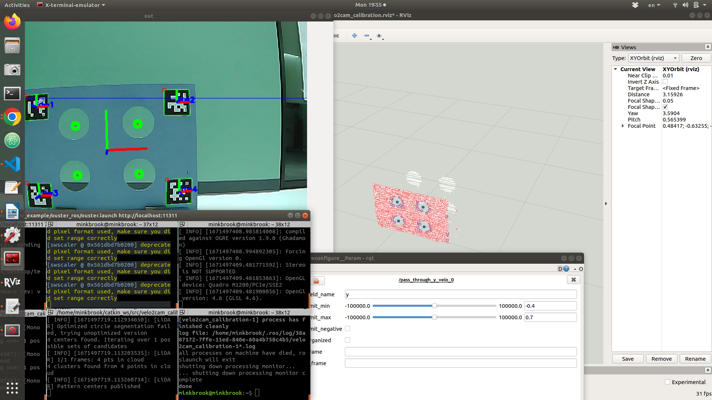
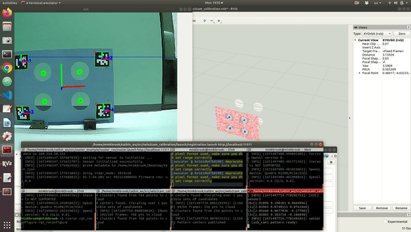

# Dartmouth Robotics lab procedure

This repo explains how to calibrate OS1-64 or Velodyne LiDAR with monocular camera at Dartmouth Robotics lab.
## Author
* Mingi Jeong

## Requirements
1. Ubuntu 16.04, 18.04
2. ROS Kinetic, Melodic on host

## Directory Tree
```
.
├── cfg
│   ├── Lidar.cfg
│   ├── Monocular.cfg
│   ├── Plane.cfg
│   └── Stereo.cfg
├── CITATION.cff
├── CMakeLists.txt
├── HOWTO.md
├── include
│   └── velo2cam_utils.h
├── launch
│   ├── lidar_pattern.launch
│   ├── mono_pattern.launch
│   ├── ouster
│   ├── registration.launch
│   ├── remap.launch
│   ├── stereo_pattern.launch
│   └── velodyne
├── LICENSE.md
├── msg
│   └── ClusterCentroids.msg
├── package.xml
├── README.md
├── RLAB.md
├── screenshots
│   ├── calibration_target_real_scheme_journal.png
│   ├── lidar_filters_1.png
│   ├── lidar_filters_2.png
│   ├── real_results.png
│   ├── stereo_filters_1.png
│   └── stereo_filters_2.png
└── src
    ├── disp_masker.cpp
    ├── lidar_pattern.cpp
    ├── mono_qr_pattern.cpp
    ├── plane.cpp
    ├── stereo_pattern.cpp
    └── velo2cam_calibration.cpp
```

## Build / Setup
Please refer to the original [README.md](README.md).
* Ouster driver: https://github.com/ouster-lidar/ouster-ros\
The driver was origianlly contained and built by `ouster_example` repo but not they are separated.
* Make sure you conducted `intrinsic` calibration first and the camera node is executed based on that __yaml__ file.

## Run
The following example shows `OS1-64` for lidar.\
Please look at the example images which I did for `VLP-16`. https://www.dropbox.com/scl/fo/k5ypzuyx7zki7jfx0jfj8/h?dl=0&rlkey=21714k1m6ui5he4h7zburidt9

### 1. LiDAR driver running
Note that `udp_dest` is our host computer IP address which can be found in the network setting menu or by __wireshark__.\
Note that the `os_cloud_node/points` use point clouds wrt `os_sensor` frame where __x__ axis faces forward.
old driver. should be replaced.
```
roslaunch ouster_ros ouster.launch sensor_hostname:=os-992121000445.local udp_dest:=169.254.10.231 metadata:=/home/minkbrook/Desktop/test.json lidar_mode:=1024x10 viz:=false
```

### 2. Camera driver running
Note that I falied to make it operate well by using my custom `usb_cam` launch. 
```
rosrun usb_cam usb_cam_node
```
* Make sure you set up a proper parameter for camera (frame_id, video_device, format, autoexposure..).
e.g., rosparam set /usb_cam/video_device /dev/video1 (depending on `v4cl device list`)
* Make sure that you run correct `.yaml` file for intrinsic calibration
```
rosparam set autoexposure true
rosparam set auto_focus false
rosparam set usb_cam/video_device /dev/video1
rosparam set usb_cam/image_height 480
rosparam set usb_cam/image_width 640
rosparam set usb_cam/pixel_format mjpeg
rosparam set /usb_cam/camera_frame_id usb_cam
```

###  3. Setup the environment
Install properly the calibration board. Use clamps and have a sufficient distance off from the wall.

### 4. Camera calibration
You should see `open-cv` popup with 4 Aruco Markers and 4 center circles detected. Aruco Marker numbers are [[1,2],[3,4]] from the top.
```
roslaunch velo2cam_calibration mono_pattern.launch camera_name:=/usb_cam image_topic:=image_raw frame_name:=usb_cam
```
```
rviz
```
```
rosrun rqt_reconfigure rqt_reconfigure
```

* The lidar_pattern `lidar_pattern_/zyx_filtered` cloud should represent only the calibration pattern and the points corresponding to those lidar rays that go through the holes. 
Thecloud can be filtered through the parameters filter_limit_min and filter_limit_maxof the pass_through_x_velo_, pass_through_y_velo_, and pass_through_z_velo_nodes.
* On the other hand, `lidar_pattern_/range_filtered_cloud` must contain only the calibration pattern. To that end, a radial passthrough filter is available in the lidar_pattern_ node, tunable through the passthrough_radius_min and passthrough_radius_max parameters.


Note, however, that the filters do not need an exact tuning as long as the areas of interest (i.e., the pattern and the surface behind it) are well defined in the LiDAR clouds.

### 5. pattern matching
Make sure to use correct __camera_name__ and __topic__
```
roslaunch velo2cam_calibration mono_pattern.launch camera_name:=/usb_cam image_topic:=image_raw frame_name:=usb_cam
```
When the registration is finished with warm-up, it will ask you like warm-up finish`[Y/N]` and if Y typed, it will conduct calibration. Once done, it will ask whether to conduct another location. If N, it will terminate the calibration and you will get a new launch file with TF defined between the camera and lidar.



The result will be saved in `launch` folder with time marked.

## TODO 
1. custom `usb_cam` with correct parameters including parameter
2. 